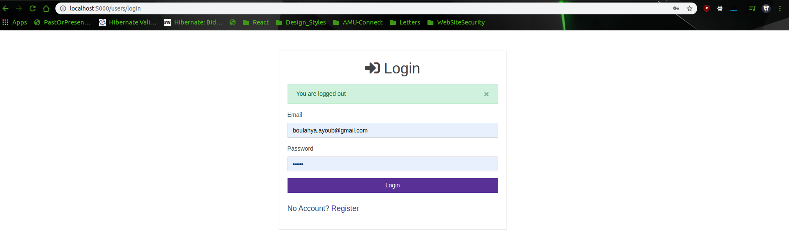
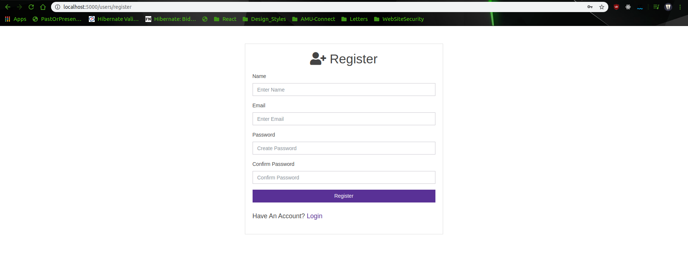
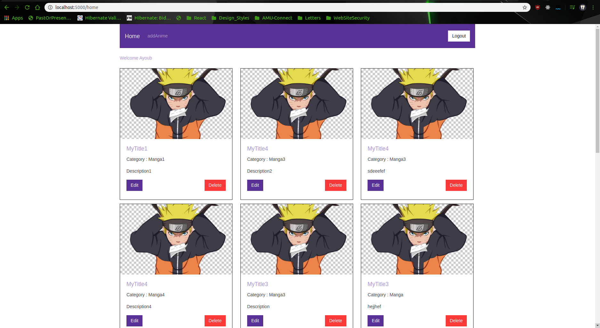
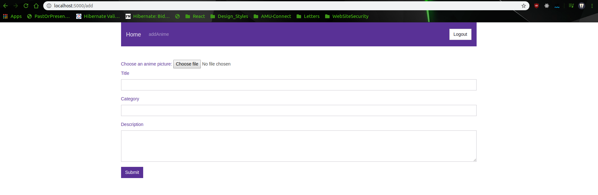

# WebAnimeApp

| Projet NodeJS & ExpressJS & MongoDB |
| ------ |
| Auto-Formation |
| Projet `WebAnimeApp` (v.0.0.1) |
***********************************************************************

AnimeApp is an attempt to create an entertainment application developed with ExpressJS and MongoDB. It offers you a fluid interface design to help you collect your favorite Mangas.

An app that let you add to your wall animes(image, title, desc etc..) so that you can show to your friends your list of animes and enjoy a long discussion about each anime.

### Features
1. Images
2. Recherche
3. Comments

### Still in progress
Edit page and some featured backlogs ...

### Screenshots :

#### Login


#### Register


#### Home


#### AddAnime


## Tech
- NodeJS
- ExpressJS
- Base de données MongoDB
- Base de données MySQL
- HTML
- ✨Bootstrap✨
- ✨awsomefont✨

### What you should have to run the app
1. NodeJS / ExpressJS / MongoDB connected on the cloud
2. Browser
3. Connection (used for bootstrap.min.js & awsomefont)

### How to run:
1. Clone the rep in a folder.
2. Create a database with MongoDB.
3. In the file `app.js`, replace the const variable `URL_CONNECTION` with your own string connection.
4. In your terminal type:
```sh
$ npm run start
```
5. Connect to `http://localhost:5000` in your browser.

## Contact
> `boulahya.ayoub@gmail.com`

> `ayoub.boulahya@etu.univ-amu.fr`

## License
**Free Software, Hell Yeah!**